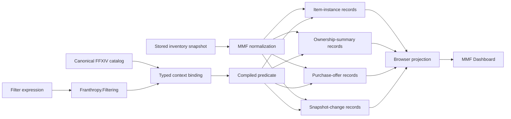

# Filter Language and Inventory Viewer Implementation Roadmap

Status: living implementation plan

Last design review: 2026-07-16

Owning repository: Franthropy

First production consumer: MarketMafioso Workshop Host Inventory Viewer

Related specifications:

- [Franthropy Filter Language](filter-language.md)
- [Canonical FFXIV Filter Vocabulary](filter-vocabulary.md)

## How to use this document

This is the implementation control document for the filter-language program. It records sequencing, repository boundaries, acceptance gates, Inventory Viewer upgrades, and decisions that should survive individual coding sessions.

Agents and maintainers should update the checklists and decision log as work lands. Architecture or vocabulary changes belong in the companion specifications first; this document should then be updated to reflect their implementation consequences.

Do not use this roadmap as permission to broaden automation. The first consumer is deliberately read-only. Squire, acquisition execution, and other actionable rules remain blocked until the language has passed the read-only production gates defined here.

## Intended outcome

The program finishes when:

- Franthropy supplies a pure, typed filter engine usable without Dalamud;
- Franthropy supplies one canonical FFXIV vocabulary with generated reference metadata;
- the MMF Inventory Viewer uses that engine for item instances, ownership summaries, and purchase offers;
- filter diagnostics and completion behave consistently across server, browser, and eventual ImGui surfaces;
- the viewer preserves relevant snapshot evidence instead of collapsing it prematurely;
- old inventory snapshots remain readable and express missing evidence as unknown;
- parser and evaluator performance are comfortably below interactive latency budgets;
- no consumer-local token parsing or vocabulary dialect remains in the migrated surfaces.

## Current progress

| Phase | State | Verification |
| --- | --- | --- |
| Documentation baseline | Complete | Architecture, vocabulary, and roadmap committed as `1b5837b` |
| Phase 1: syntax kernel | Complete | 21 filtering tests and 124 existing Franthropy tests pass |
| Phase 2: semantic binding | Complete | 58 filtering tests pass on `net10.0`; kernel builds on `net8.0` and `net10.0` |
| Phase 3: canonical FFXIV catalog | Complete | 29 documented fields, name-first resolver contracts, generated reference writers, and 8 catalog tests pass |
| Phase 4: MMF contracts and normalization | Complete locally | Shared browser DTOs, typed evidence normalization, and legacy condition behavior covered by server tests |
| Phase 5: Inventory Viewer contexts | Complete locally | Separate Items, Stacks, and Listings contexts with name-first filtering and contextual metrics; 167 server and 926 plugin tests pass |
| Phase 6: completion and help | Complete locally | Shared caret-aware completion, predicates, generated active-context help, operator algebra, source-spelling preservation, semantic normalization, and browser plus ImGui editors are covered by focused suites |
| Phase 6A: first in-game consumer | Complete locally | Squire candidate filtering binds a read-only product context to the shared compiler and reusable ImGui editor; invalid typing retains the last valid view |
| Phase 7: capture schema vNext | In progress | Schema 2 preserves physical stacks, HQ, location, container, slot, equipped, item category, and applicable condition percent; completeness and a deduplicated item catalog remain |
| Later phases | Not started | Changes mode and automation review remain gated |

## Non-negotiable boundaries

1. **The parser is not a Dalamud helper.** Generic syntax, semantics, evaluation, diagnostics, completion models, and documentation generation live outside `Franthropy.Dalamud`.
2. **Canonical terms belong to FFXIV concepts.** Consumers bind `item.*`, `instance.*`, `ownership.*`, `offer.*`, and `acquisition.*`; they do not register ordinary concepts under product names.
3. **Consumers bind evidence, not token callbacks.** MMF never receives raw syntax fragments to reinterpret.
4. **Evaluation is pure.** A predicate reads an already-built snapshot and cannot perform network calls, database queries, Dalamud interaction, travel, or mutation.
5. **Names are user-facing.** Stable IDs remain internal to records and resolvers. Numeric item IDs are not restored as ordinary filter input.
6. **Unknown is not false.** Missing capture evidence survives as unknown through comparison and negation.
7. **One record grain per context.** A physical stack, ownership aggregate, purchase offer, and snapshot change are distinct records with distinct quantity semantics.
8. **The server is authoritative for server data.** The Dashboard does not maintain a second evaluator whose behavior may drift from Workshop Host.
9. **Read-only proof precedes automation.** No Squire rule or acquisition action depends on the language until the Inventory Viewer acceptance gates pass.
10. **UI restructuring starts with static HTML.** The Inventory Viewer mode and filter-editor layout must be explored in a product-shaped HTML mockup before the Blazor UI is substantially rebuilt.

## Current implementation baseline

### Franthropy

The solution currently contains only `Franthropy.Dalamud` and its test project. Pure contracts and Dalamud-bound helpers coexist in that project. The filter program introduces explicit pure projects instead of adding more conditional compilation to the existing project.

The existing `Franthropy.Dalamud` project targets `net8.0-windows` and `net10.0-windows`, excluding live Dalamud files from the former target. The filter kernel and canonical vocabulary should avoid Windows and Dalamud requirements entirely.

### MMF Inventory Viewer

The current Workshop Host viewer pipeline is:

```text
stored InventoryReport
    -> InventoryBrowserViewBuilder.EnumerateLocations
    -> MatchesSearch(item ID or item-name substring)
    -> group by item and owner/bag
    -> InventoryBrowserView
    -> Blazor Inventory page
```

The Dashboard sends the search text to `/api/inventory/browser` after a 250 ms debounce. `InventoryBrowserViewBuilder.MatchesSearch` filters raw item locations before aggregation. The browser models are duplicated in `MarketMafioso.Server` and `MarketMafioso.Dashboard` rather than shared through `MarketMafioso.Contracts`.

The current viewer mixes several grains on one page:

- aggregated item rows;
- owner/bag location summaries;
- retainer market listings;
- snapshot and scope metrics.

That surface is useful, but it cannot safely assign one meaning to `quantity`, `quality`, `condition`, and `price` without making the active record grain explicit.

## Evidence audit

### Already captured and persisted

The existing report and SQLite schema already retain:

- item ID and localized item name;
- item type label;
- stack quantity;
- HQ/NQ state;
- condition;
- bag name;
- player or retainer owner;
- owner character and home world;
- report timestamp and retainer update timestamp;
- retainer gil;
- retainer market-listing quantity, quality, condition, unit price, and listing timestamp.

Some of this evidence is discarded during browser projection. In particular, inventory condition and listing condition do not survive into the current browser view models. Restoring those values requires no plugin capture expansion.

### Captured ambiguously

`Condition` is currently a non-null floating-point value whose default is zero. Zero can mean a legitimately broken item or absent legacy capture, while the old HTML viewer renders values less than or equal to zero as unavailable. The filter implementation must not preserve that ambiguity as a false fact.

For legacy schemas, normalization should conservatively treat an unqualified zero as unknown unless the schema version proves condition was explicitly captured. The next schema should use nullable evidence or an explicit known flag so a true zero condition remains representable.

Bag names currently carry container meaning as strings. A canonical location resolver can normalize known names, but new captures should include a stable semantic container key and preserve the visible bag label separately.

### Not currently captured

The present payload does not supply:

- exact container slot identity;
- equipped state as an explicit fact;
- spiritbond;
- materia;
- glamour and stains;
- collectability or binding state;
- crafter identity;
- item level and equip level;
- eligible jobs and equipment slots;
- normalized rarity and UI category;
- tradability and other item-definition flags;
- capture-completeness evidence sufficient to prove that an absent item is not owned.

These require a versioned payload expansion or a separately versioned item-definition catalog. They must not be inferred from display strings or default CLR values.

## Target architecture



### Franthropy projects

```text
src/
  Franthropy.Filtering/
  Franthropy.FFXIV/
  Franthropy.Dalamud/
tests/
  Franthropy.Filtering.Tests/
  Franthropy.FFXIV.Tests/
  Franthropy.Dalamud.Tests/
```

- `Franthropy.Filtering` owns generic language mechanics and targets ordinary supported .NET runtimes.
- `Franthropy.FFXIV` references the kernel and owns canonical field descriptors, stable named values, and resolver contracts without depending on Dalamud.
- `Franthropy.Dalamud` references the pure projects and later supplies Lumina-backed value providers and ImGui rendering.

### MMF ownership

- `MarketMafioso.Contracts` owns versioned Inventory Report and browser transport DTOs shared by plugin, server, and Dashboard.
- `MarketMafioso.Server` owns normalization of persisted snapshots, context bindings over server records, predicate execution, context/reference endpoints, and browser projections.
- `MarketMafioso.Dashboard` owns dense presentation and interaction while consuming server diagnostics, completion, and results.
- The in-game `MarketMafioso` project owns live capture and emits versioned evidence. It does not implement filter parsing.

## Implementation sequence

Each phase must land as a reviewable slice. A later phase may begin locally while an earlier review is pending, but release branches must preserve this dependency order.

### Phase 0: establish a clean baseline

Deliverables:

- land the architecture, vocabulary, and this roadmap as a documentation commit;
- land unrelated existing Franthropy UI/autocomplete work separately;
- verify both repositories are on the intended integration branches before feature work;
- create an isolated Franthropy feature branch or worktree for the language kernel;
- record baseline test counts and commands.

Exit criteria:

- documentation history is not mixed with parser implementation;
- no unrelated dirty source is absorbed into filter commits;
- Franthropy and MMF test baselines are green or have explicitly recorded pre-existing failures.

### Phase 1: syntax kernel

Create `Franthropy.Filtering` and `Franthropy.Filtering.Tests`.

Deliverables:

- immutable `TextSpan` and source-text primitives;
- tokenizer with exact spans and trivia handling;
- recoverable AST supporting free text, field comparisons, ranges, value lists, grouping, implicit `AND`, explicit boolean operators, negation, and `known`/`unknown` calls;
- parser diagnostics with stable codes and suggested fixes;
- formatter and normalized expression output;
- configurable query length, token count, nesting, list, and diagnostic limits;
- conformance fixtures recording tokens, AST shape, normalized expression, and diagnostics.

Initial safety defaults:

- maximum expression length: 2,048 characters;
- maximum tokens: 256;
- maximum nesting depth: 32;
- maximum values in one list: 128;
- maximum diagnostics returned: 20.

These are starting limits, not eternal public constants. Changes require tests and documentation.

Exit criteria:

- malformed and incomplete typing never throws;
- precedence and implicit `AND` are proven by golden tests;
- quoted Unicode item names and punctuation round-trip;
- the project builds and tests without Dalamud, Lumina, Windows UI, or MMF references.

### Phase 2: semantic binding and pure evaluation

Deliverables:

- immutable catalogs, field keys, descriptors, aliases, and types;
- typed contexts and field bindings;
- `Known<T>` and `Unknown<T>` evidence;
- three-valued truth tables;
- type-specific literal parsing and operator validation;
- name and leaf resolution with ambiguity diagnostics;
- compiled predicates and cache keys;
- editor-neutral completion and reference models;
- synthetic test catalogs and records.

Critical tests:

- negating unknown remains unknown;
- unavailable and unknown fields produce different outcomes;
- `instance.quantity` and `offer.quantity` cannot collapse in a composite context;
- a globally unique unavailable leaf produces an availability diagnostic;
- fuzzy and exact equality modes form paired positive and negative operators, while set fields consistently test member overlap;
- named-value resolution can report ambiguity without selecting an arbitrary ID;
- cache invalidation includes catalog version, context ID, context schema version, expression, and locale.

Exit criteria:

- no consumer callback receives raw tokens;
- predicate evaluation is synchronous and side-effect free;
- all documented diagnostic classes have stable test coverage.

### Phase 3: canonical FFXIV catalog

Create `Franthropy.FFXIV` and its tests.

Deliverables:

- descriptors for every field in the canonical vocabulary document;
- stable named values for quality, equipment slot, normalized location, offer source, acquisition source, and region;
- resolver contracts for items, jobs, categories, characters, retainers, worlds, and data centers;
- generated Markdown and JSON reference output;
- catalog snapshot tests covering paths, aliases, types, operators, descriptions, examples, versioning, and deprecations.

Implementation order for resolvers:

1. quality, quantity, condition, and simple booleans;
2. semantic inventory locations;
3. character and retainer names;
4. item names;
5. worlds, data centers, and regions;
6. jobs, slots, categories, rarity, and acquisition values.

All descriptors may exist before every context can bind them. An unbound canonical field remains known to the language and yields an availability diagnostic.

Exit criteria:

- the architecture catalog and generated reference agree;
- alias collisions fail registration;
- at least two synthetic contexts bind overlapping fields without changing their meaning.

### Phase 4: stabilize MMF contracts and normalization

Before exposing filter diagnostics over HTTP, remove transport duplication.

Deliverables:

- move or replace duplicated Inventory Browser DTOs with shared models under `MarketMafioso.Contracts`;
- keep JSON shapes backward compatible where practical;
- add shared transport DTOs for filter status, diagnostics, suggestions, replacement spans, context identity, and normalized text;
- separate snapshot normalization from browser projection;
- introduce internal normalized record types for instances, ownership summaries, and offers;
- preserve condition and listing condition through normalization;
- parse report and listing timestamps into typed evidence;
- normalize container names through stable semantic location keys while preserving display labels.

The target server pipeline becomes:

```text
stored report
    -> normalized evidence records
    -> context-specific predicate
    -> context-specific aggregation or projection
    -> shared browser response DTO
```

Exit criteria:

- Server and Dashboard no longer maintain independent copies of inventory browser contracts;
- existing snapshots produce the same unfiltered totals as before;
- condition is either accurately known or explicitly unknown;
- normalization tests cover legacy schema versions.

### Phase 5A: item-instance filtering and Stacks mode

The first production context is `ffxiv.item-instances` because the current builder already filters before aggregation.

Initial bindings:

- `item.name`;
- `instance.quality`;
- `instance.quantity`;
- `instance.location`;
- `instance.condition` when known;
- `ownership.character` as attribution;
- `ownership.retainer` as attribution.

Deliverables:

- add a dense **Stacks** mode to Inventory Viewer;
- compile and apply expressions on the server;
- keep character and scope selectors as direct controls;
- accept ordinary item-name text without requiring syntax;
- replace “Search by item name or id” with a name-first filter label;
- stop matching numeric item IDs in ordinary text;
- show IDs only under optional technical detail;
- return precise diagnostics without converting transient typing into server errors.

Invalid-expression behavior:

- the endpoint returns a successful transport response with `Applied=false` and diagnostics;
- the Dashboard keeps the last successfully applied results visible;
- the invalid text remains editable;
- no invalid expression silently becomes an empty or unfiltered predicate.

Exit criteria:

- `darksteel`, `quality:HQ`, `location:retainer quantity>=20`, and `condition<100` work against real stored snapshots;
- old snapshots with ambiguous condition do not match condition predicates unless evidence is known;
- malformed input highlights the exact span and never clears the user's last valid view;
- server tests prove plain name search remains case-insensitive and localized.

### Phase 5B: ownership-summary filtering and Items mode

The existing aggregated item table becomes the **Items** mode and binds `ffxiv.ownership-summaries` after aggregation.

Initial bindings:

- `item.name`;
- `ownership.quantity`;
- `ownership.character`;
- `ownership.retainer`;
- aggregated location evidence through an appropriate set-valued binding or a future canonical field reviewed in the vocabulary specification.

The default Items mode begins with records derived from observed items, so every row already has some ownership evidence. It must not advertise `-owned`: absent items are not records in that universe. `ownership.owned` becomes useful only in a context that starts from an external candidate catalog, pinned list, recipe requirements, or another universe containing both owned and unowned items.

Deliverables:

- aggregate normalized instances before applying ownership predicates;
- make total ownership distinct from any individual stack quantity;
- support latest-snapshot aggregation across selected characters;
- show freshness per contributing character and retainer;
- mark incomplete ownership scopes and treat total ownership quantity as unknown when missing contributors could change it;
- keep the selected item's location detail available without duplicating the table as another competing summary.

Exit criteria:

- `ownership.quantity<10` evaluates over the selected ownership scope;
- combining latest snapshots never hides their differing timestamps;
- Items and Stacks modes produce explainably different quantity results.

### Phase 5C: purchase-offer filtering and Listings mode

Retainer market listings become a dedicated **Listings** mode using `ffxiv.purchase-offers`.

Initial bindings:

- `item.name`;
- `instance.quality` for the represented listed stack;
- `offer.source` fixed to `market` for retainer listings;
- `offer.price`;
- `offer.totalPrice`;
- `offer.quantity`;
- `offer.world` from the owning character's home world when known;
- `offer.dataCenter` and `offer.region` through the world catalog;
- `offer.age` from listing or retainer observation timestamps.

Deliverables:

- preserve listing condition as evidence even if it is not a default column;
- calculate total price with checked arithmetic;
- distinguish listed-at age from snapshot-received age;
- provide contextual metrics such as matching listing quantity and total listed value;
- keep offer fields unavailable in Stacks mode rather than pretending inventory has a price.

Exit criteria:

- `offer.source:market price<5000 age<=30m` works;
- unknown price or age remains unknown under negation;
- world and data-center values resolve by name, never by asking for row IDs.

### Phase 6: shared completion, help, and saved expressions

Deliverables:

- server completion endpoint accepting context ID, expression, caret position, and cancellation;
- context-reference endpoint serving generated field and named-value metadata;
- inline Dashboard completion popup and exact-span diagnostics;
- compact contextual help rather than instructional paragraphs;
- per-mode filter text so an unavailable field in one mode does not destroy another mode's working expression;
- URL persistence for active mode, scope, and expression;
- filter history, followed by explicitly named saved filters after compatibility envelopes exist.

The Dashboard may parse spans locally for rendering only if it consumes the same serialized syntax service or shared pure package. It must never independently reinterpret field semantics or evaluate server records.

Exit criteria:

- completion after `quality:` offers NQ and HQ;
- completion after `location:` offers semantic names present in the catalog;
- ambiguous `quantity` in a composite future context offers qualified replacements;
- generated help exactly matches the active catalog and context availability.

### Phase 7: inventory capture schema vNext

Expand capture only after the first viewer contexts demonstrate which evidence users actually query.

#### Per-instance additions

- semantic container key and exact slot index;
- explicit `conditionKnown` or nullable condition;
- equipped state;
- spiritbond and evidence status;
- materia IDs with name resolution supplied through the item catalog;
- glamour item and stain identities;
- collectability, binding, crafter, and other instance facts selected through vocabulary review.

#### Deduplicated item-definition catalog

Add an `itemCatalog` section keyed internally by item ID rather than repeating definition data on every stack. Entries should include the game-data and locale provenance necessary to invalidate stale definitions.

Candidate definition evidence:

- localized item name;
- item and equip level;
- eligible job identities;
- equipment slots;
- rarity and UI category;
- tradability and desynthesis eligibility;
- other canonical flags admitted through vocabulary review.

Workshop Host should persist definitions by a versioned key such as game-data version, locale, and item ID. Basic Inventory Viewer behavior must not depend on a live third-party data service.

#### Completeness metadata

Reports should state which containers and owners were attempted, captured, unavailable, or stale. Ownership absence becomes known only when the active scope is complete enough to prove it.

Backward compatibility:

- bump the report schema version;
- continue accepting supported older schemas;
- map missing fields to unknown, not defaults;
- preserve raw JSON independently from structured retention;
- add golden payload fixtures for every supported schema version;
- never rewrite historical raw reports to imply newly captured evidence.

Exit criteria:

- new clients distinguish broken condition from unknown condition;
- old clients or servers fail gracefully according to documented compatibility policy;
- payload growth is measured and item-definition duplication is bounded.

### Phase 8: Changes mode and historical queries

Add `ffxiv.inventory-changes` only after stable record identity is available.

Deliverables:

- compare a selected snapshot against the prior compatible snapshot;
- distinguish added, removed, quantity-changed, quality-changed, and moved records;
- preserve old and new owner/location evidence;
- display snapshot times and compatibility warnings;
- propose canonical `change.*` or `snapshot.*` vocabulary in the vocabulary document before implementation;
- add a dense **Changes** mode with contextual metrics.

Legacy snapshots without slot identity may support aggregate quantity changes but must not claim exact stack movement.

Exit criteria:

- change identity rules are documented and deterministic;
- movement is reported only when evidence establishes it;
- historical filtering remains read-only and does not alter retention.

### Phase 9: Dalamud editor and automation-consumer review

After the browser implementation is stable:

- add `Franthropy.Dalamud.UI.Filtering` using the same completion, diagnostic, and reference models;
- visually test the ImGui editor through the claimed MMF lane and Dalamud Agent Bridge;
- evaluate Squire rule targeting, acquisition request filtering, retainer selection, and Craft Architect as separate consumers;
- require an explicit safety review before a filter selects actionable automation targets;
- keep rule action, confirmation, checkpointing, and audit outside the filter language.

Exit criteria for the first automation consumer must be written when that consumer is selected. Inventory Viewer success alone does not authorize action execution.

## Inventory Viewer target interaction model

The substantial UI restructuring requires a static HTML mockup before Blazor implementation. The target should remain dense and product-shaped, not presented inside a design-slide frame.

### Persistent frame

- character/snapshot selector;
- scope selector;
- compact mode selector: Items, Stacks, Listings, Changes when available;
- one filter input in a consistent location, with state retained per mode;
- contextual metrics derived from the filtered records;
- table and selected-record detail occupying the primary space.

### Mode semantics

| Mode | Record grain | Primary quantity | Typical detail |
| --- | --- | --- | --- |
| Items | ownership summary | `ownership.quantity` | contributing characters, retainers, and locations |
| Stacks | physical item stack | `instance.quantity` | owner, container, condition, quality, slot evidence |
| Listings | purchase offer | `offer.quantity` | unit/total price, world, source, age |
| Changes | snapshot delta | future `change.quantityDelta` | previous/current evidence and timestamps |

The mode label and columns should make grain evident without instructional prose. Healthy parsing remains quiet; errors and unavailable fields appear only when attention is needed.

### Details and IDs

Item names remain primary. Numeric item IDs, internal container IDs, schema versions, and raw evidence may appear in a technical-details disclosure, but they should not occupy the normal item row or search label.

### Scope controls versus filter syntax

Character and ownership scope remain visible selectors because they change the evidence universe, not merely which records match. Filters may further select `character:` or `retainer:` inside that universe. The UI should never make users encode basic scope selection in syntax just because the language technically could express a similar predicate.

## HTTP and transport plan

### Browser query

Evolve the endpoint toward:

```text
GET /api/inventory/browser?mode=stacks&filter=quality%3AHQ&scope=all
```

During migration:

- Dashboard switches to `filter`;
- the existing `search` parameter remains temporarily supported as legacy name/ID search for external compatibility;
- `filter` takes precedence when both are supplied;
- removal of `search` requires a documented compatibility boundary;
- numeric item-ID matching is not carried into the new free-text semantics.

### Response envelope

The browser response should contain:

- active context ID and schema version;
- original and normalized expression;
- `Applied` state;
- diagnostics with code, severity, span, message, and fixes;
- filtered mode data and metrics when applied;
- catalog/version metadata required for completion cache invalidation.

Live typing errors are ordinary application state and should not use HTTP 500. Authentication, malformed transport, unavailable snapshots, and server failures remain transport concerns distinct from filter diagnostics.

### Completion and reference

Prefer a POST completion endpoint because expressions, caret positions, and future context may exceed comfortable query-string shapes:

```text
POST /api/filtering/complete
GET  /api/filtering/contexts/{contextId}/reference
```

Completion requests are cancellable and carry catalog/context versions. Responses specify replacement spans rather than asking the client to infer token boundaries.

## Performance budgets

Establish machine-recorded baselines before optimizing. Initial targets for ordinary expressions are:

- tokenize, parse, and bind a 512-character expression in under 5 ms at the 95th percentile after process warm-up;
- evaluate a compiled predicate over 50,000 normalized records in under 25 ms on the development baseline;
- perform no avoidable allocation per record in the hot evaluation path;
- avoid recompilation when only the record set changes;
- keep local Inventory Viewer filter responses below 150 ms at the 95th percentile for retained snapshot sizes represented by tests;
- cancel superseded Dashboard requests during rapid typing.

These are engineering budgets, not user-facing guarantees. Record the machine and dataset with benchmark results. A missed budget requires profiling and an explicit decision; it must not be hidden by increasing debounce until the UI feels sluggish.

Recorded local baseline (2026-07-16, .NET 10.0.9, Windows 10.0.19045, 12 logical processors):

- ordinary expression compilation p95: 0.009 ms over 2,000 samples;
- 50,000-record evaluation: 16.171 ms;
- evaluator hot-path allocation: 0 bytes.

The repeatable harness lives in `benchmarks/Franthropy.Filtering.Benchmarks` and exits unsuccessfully when these initial compile, throughput, or allocation budgets regress.

## Test program

### Franthropy kernel

- tokenizer and parser golden corpus;
- incomplete-input corpus at every token boundary;
- diagnostic span and suggested-fix snapshots;
- property and fuzz tests for non-throwing hostile input;
- three-valued truth tables;
- type/operator conformance;
- catalog and alias collision tests;
- normalized-expression round trips;
- compilation cache invalidation;
- benchmarks and allocation measurements.

### FFXIV vocabulary

- catalog snapshot containing all canonical fields;
- stable named-value keys and aliases;
- localized item/job/world resolver fixtures;
- ambiguous name handling;
- context availability contracts;
- generated Markdown/JSON reference comparison.

### MMF server

- legacy and current Inventory Report fixtures;
- unfiltered normalization parity with existing totals;
- condition zero versus unknown evidence;
- each viewer context's binding contract;
- invalid-filter response behavior;
- server-side filtering before or after aggregation according to mode;
- checked total-price calculations;
- latest-snapshot selection and freshness;
- cross-character completeness;
- endpoint authentication and cancellation.

### Dashboard

- plain name filtering;
- mode-specific expression persistence;
- last-valid-results behavior during invalid typing;
- diagnostic span rendering;
- completion replacement behavior;
- URL restoration;
- narrow and wide layouts;
- keyboard-only and screen-reader labels;
- full interaction loop using realistic retained snapshots.

### Live capture

When schema vNext touches the plugin:

- claim only the intended MMF test lane;
- deploy only that lane;
- verify capture through the Dalamud Agent Bridge;
- upload and inspect a real report in Workshop Host;
- compare raw payload, structured persistence, normalized records, and viewer output;
- release the lane after testing;
- never restart or close another game instance as part of the test.

## Review and release gates

### Gate A: kernel ready

- pure projects exist;
- conformance and hostile-input tests pass;
- no consumer dependency exists yet.

### Gate B: catalog ready

- canonical descriptors match the vocabulary document;
- generated reference is stable;
- two synthetic contexts prove shared semantics.

### Gate C: Inventory Viewer pilot ready

- Stacks mode filters real stored snapshots;
- diagnostics and last-valid behavior work in Dashboard;
- plain item-name search remains excellent;
- performance budgets are measured;
- static mockup and browser screenshots have received visual review.

### Gate D: Inventory Viewer contexts complete

- Items, Stacks, and Listings use distinct contexts;
- quantity and source ambiguity are eliminated by grain;
- old snapshots degrade to unknown evidence;
- contracts are shared rather than duplicated.

### Gate E: capture schema ready

- schema compatibility fixtures pass;
- real in-game capture and upload are proven through the claimed lane;
- payload size and persistence migration are reviewed;
- incomplete capture cannot masquerade as ownership absence.

### Gate F: automation review permitted

- read-only usage has survived production use;
- diagnostic and compatibility behavior is stable;
- an explicit consumer-specific safety design is approved.

## Commit and repository sequencing

Preferred commit order:

1. `docs: define Franthropy filter language and implementation roadmap`
2. `feat(filtering): add syntax kernel and conformance tests`
3. `feat(filtering): add typed binding and evaluation`
4. `feat(ffxiv): add canonical filter vocabulary`
5. `refactor(inventory): share browser contracts and normalize evidence`
6. `feat(inventory): add item-instance filtering and Stacks mode`
7. `feat(inventory): add ownership and offer contexts`
8. `feat(filtering): add completion and generated help`
9. `feat(inventory): add versioned capture evidence`
10. `feat(inventory): add historical Changes mode`

Land Franthropy primitives and their independent verification before the MMF commit that consumes them. Avoid commits that mix parser internals, payload migrations, and visual reconstruction; those concerns should remain revertible and reviewable independently.

## Working checklist

### Documentation and baseline

- [x] Architecture, vocabulary, and roadmap committed to Franthropy.
- [x] Existing unrelated Franthropy autocomplete work isolated.
- [x] Baseline Franthropy test result recorded: 124 passing tests before the kernel.
- [x] Feature branch/worktree established as `filter-language`.

### Kernel

- [x] `Franthropy.Filtering` project created.
- [x] Tokenizer and source spans implemented.
- [x] Recoverable parser implemented.
- [x] Formatter and normalized output implemented.
- [x] Complexity limits implemented.
- [x] Conformance and hostile-input corpus green: 21 tests.

### Semantics

- [x] Type system and operators implemented.
- [x] Catalog and context registration implemented.
- [x] Known/unknown evidence implemented.
- [x] Three-valued evaluator implemented.
- [x] Compilation cache implemented.
- [x] Completion, completion service, and reference models implemented.

### Canonical FFXIV catalog

- [x] `Franthropy.FFXIV` project created.
- [x] All canonical field descriptors registered.
- [x] Named value catalogs implemented.
- [x] Name-first resolver contracts implemented.
- [x] Generated Markdown/JSON reference implemented.
- [x] Catalog snapshot tests green.

### Inventory Viewer foundation

- [x] Browser DTO duplication removed.
- [x] Normalization separated from projection.
- [x] Existing condition evidence preserved and normalized across legacy fraction/percentage scales.
- [x] Legacy unknown-condition behavior tested.
- [x] HTML mockup covers Items, Stacks, and Listings; Changes remains a later-phase surface.

### Inventory Viewer contexts

- [x] Stacks mode and item-instance context complete.
- [x] Items mode and ownership-summary context complete.
- [x] Listings mode and purchase-offer context complete.
- [x] Contextual metrics verified.
- [x] Invalid typing retains last valid results.
- [x] Completion and contextual reference use the active bound context.

### Capture and history

- [x] Schema vNext additive evidence boundary designed and implemented for the first proven instance fields.
- [ ] Completeness metadata implemented.
- [ ] Deduplicated item catalog implemented.
- [x] Physical stack, HQ, semantic location, container, slot, equipped, and explicit condition evidence implemented.
- [x] Capture enriches item category and suppresses condition evidence for item definitions that do not support repair condition.
- [x] Old schema persistence and normalization remain supported.
- [ ] Real capture/upload/view loop verified.
- [ ] Changes vocabulary proposed and approved.
- [ ] Changes mode implemented.

### Release readiness

- [x] Performance budgets measured and enforced by a repeatable harness.
- [ ] Accessibility and responsive layout reviewed.
- [x] Browser interaction loop visually tested across help, selection, invalid typing, completion acceptance, per-mode state, and Listings restoration.
- [ ] Generated documentation published from catalog artifacts.
- [ ] Read-only production gates passed before automation review.

## Decision log

| Date | Decision | Consequence |
| --- | --- | --- |
| 2026-07-16 | Build one Franthropy-owned language rather than consumer dialects. | Grammar, diagnostics, completion, and base verbiage remain intrinsic to Franthropy. |
| 2026-07-16 | Canonical paths describe semantic subjects, not modules. | Contexts bind shared terms; product-only workflow state is namespaced. |
| 2026-07-16 | Use Inventory Viewer as the first production consumer. | Read-only evidence validates the language before automation can depend on it. |
| 2026-07-16 | Allow Inventory Viewer upgrades when they preserve evidence or clarify record grain. | Viewer work may expand alongside integration without becoming an unrelated redesign. |
| 2026-07-16 | Separate Items, Stacks, Listings, and Changes. | Quantity, quality, price, and location keep precise meanings. |
| 2026-07-16 | Keep repository documentation authoritative. | GitHub wiki or Pages content should be generated mirrors, not separately edited sources. |
| 2026-07-16 | Distinguish item acquisition sources from actionable offer sources. | `acquisition.source` and `offer.source` coexist; duplicate craft/vendor booleans are avoided. |
| 2026-07-16 | Treat IDs as internal. | Inputs, completion, examples, and ordinary rows remain name-first. |
| 2026-07-16 | Preserve old snapshots through unknown evidence. | Schema expansion is additive and never fabricates new historical facts. |
| 2026-07-16 | Keep typed evidence through the compiled hot path. | Evaluation no longer boxes value evidence or allocates per-record LINQ iterators. |
| 2026-07-16 | Return active-context completion and reference metadata with the cancellable browser response for the pilot. | One snapshot-specific context build powers results and editor metadata; a separate endpoint remains optional if measured payload cost warrants it. |
| 2026-07-16 | Limit the first schema-2 expansion to evidence already proven useful by Stacks mode. | Completeness, spiritbond, materia, glamour, and the deduplicated item catalog remain explicit follow-up slices rather than speculative payload growth. |
| 2026-07-16 | Treat condition as applicable item-definition evidence, not a universal numeric slot value. | Non-repairable items expose unknown condition instead of masquerading as broken at zero percent. |
| 2026-07-18 | Use Squire candidate search as the first in-game consumer. | The language filters an already-computed read-only review table; it does not select, authorize, route, or execute cleanup actions. |
| 2026-07-18 | Put ImGui completion editing in `Franthropy.Dalamud.UI.Filtering`. | Browser and Dalamud surfaces share core replacement spans, completion semantics, diagnostics, and generated context metadata rather than maintaining UI-local parsers. |

## Open implementation questions

Resolve these at the named phase and record the answer in the decision log:

- Phase 1: preferred normalized operator spelling and percentage literal normalization.
- Phase 3: exact stable keys and aliases for inventory locations, rarity, and acquisition sources.
- Phase 4 resolved: browser transport moved to `MarketMafioso.Contracts`; the established report contract remains compatibility-adapted until a dedicated shared-report migration earns its own slice.
- Phase 5B: canonical representation for an ownership summary's set of contributing locations.
- Phase 6 resolved for the pilot: the Dashboard renders server diagnostics, completion spans, and generated context metadata without implementing semantic parsing.
- Phase 7: item-catalog invalidation key and acceptable payload-size budget.
- Phase 7: explicit completeness model for player bags, armoury, retainers, and offline characters.
- Phase 8: stable change identity before and after exact slot capture exists.
- Phase 9: first automation consumer and its consumer-specific safety gate.
